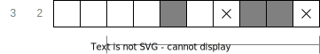
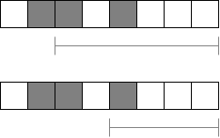

# Algorithm
*This document assumes that you know what a nonogram is and how to solve them.*

The following terms are used throughout the document and source code:
* **Cell**: A cell on the nonogram grid.
* **Box**: A filled cell.
* **Space**: An space "X" cell.
* **Chain**: A chain of boxes defined by one of the numbers outside the grid.
* **Range**: Refers to the range of positions a chain could have.

The approach this algorithm takes is to narrow down the location of each chain.
Then spaces and boxes are filled in and the process is repeated until the nonogram is solved.

## Narrowing down the location
To narrow down the location three techniques are used.
These have to be applied in order!
We will only take a look at how to find the start of the range.
Finding the end is the same process just in the opposite direction.

### 1. Reduce start by box at the end
If there are boxes on the right of this chain, 
which cannot be covered by another chain on the right,
then they must belong to this chain.
In the example below, we can reduce the start of the range of the first chain to the indicated area.

How to implement:
* Take the start of the chain of the right (if there is any).
* Iterate backward.
* Stop at the first box with the same color.
* Subtract the length of the chain.

See: `nonogram_rs::algo::chain::Chain::reduce_start_by_box_at_end`

### 2. Reduce start by adjacent
Two chains with the same color cannot be adjacent to each other.
Thus, if the cell to the left of the start is a box with the same color, 
we have to reduce the start past these boxes.

How to implement:
* Look at the cell to the left of the start (if there is any).
* Check if it is a box of the same color.
* If yes, advance by one and repeat.

See: `nonogram_rs::algo::chain::Chain::reduce_start_by_adjacent`

### 3. Reduce start by gabs
This one is very straightforward, a chain cannot overlap with spaces or boxes with a different color.
If the area after the start is blocked by spaces (or boxes) we have to reduce the start past them.

How to implement:
* Iterator the cells past the start.
* If it is empty or a box with the same color, count up.
* If it is a space or a box with a different color, reset the count to zero.
* Continue until the count is equal to the length of the chain.

See: `nonogram_rs::algo::chain::Chain::reduce_start_by_gabs`

