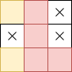

# nonogram-rs
A fast and lightweight nonogram solving library.

Features:
* Solving regular nonograms
* Solving colored nonograms
* Arbitrary color type
* De/serializing a layout (requires `serde` feature)
* De/serializing a nonogram (requires `serde` feature)

Examples of how to use this library can be found in the `tests/` directory.

## Command-line interface
This library includes a CLI called `nonogram-cli` as a binary target.

```shell
cargo build --bin nonogram-cli --features='cli'
```
```shell
# Solve
cat layout.json | ./nonogram-cli solve > result.json

# Show
cat result.json | ./nonogram-cli show

# Both in one line
cat layout.json | ./nonogram-cli solve | ./nonogram-cli show
```
#### Example layout
```json
{
  "cols": [
    [["y", 1], ["y", 1]],
    [["r", 3]],
    [["r", 1]]
  ],
  "rows": [
    [["y", 1], ["r", 1]],
    [["r", 1]],
    [["y", 1], ["r", 2]]
  ]
}
```

#### Example nonogram
```json
{
  "rows":[
    [{"Box":{"color":"y"}}, {"Box":{"color":"r"}}, "Space"],
    ["Space",               {"Box":{"color":"r"}}, "Space"],
    [{"Box":{"color":"y"}}, {"Box":{"color":"r"}}, {"Box":{"color":"r"}}]
  ]
}
```

#### Result


#### Colors
The following colors are supported by the CLI.
Lowercase letters are dark and uppercase letters are bright colors.
Note that the library supports arbitrary color types.

| Key | Color     | Key | Color   | Key | Color        |
|:---:|:----------|:---:|:--------|:---:|:-------------|
|  !  | default   |  R  | red     |  r  | dark red     |
|  0  | black     |  G  | green   |  g  | dark green   |
|  1  | dark grey |  Y  | yellow  |  y  | dark yellow  |
|  2  | gray      |  B  | blue    |  b  | dark blue    |
|  3  | white     |  M  | magenta |  m  | dark magenta |
|     |           |  C  | cyan    |  c  | dark cyan    |

## Algorithm
The algorithm is explained in detail in a [separate document](ALGORITHM.md).

## License
This software (including the complete source code) is licensed under the [GPLv3](LICENSE).