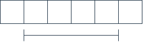
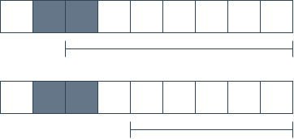
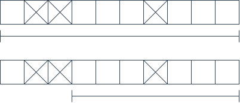
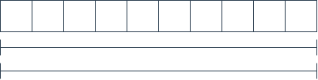
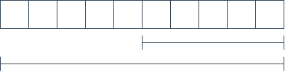
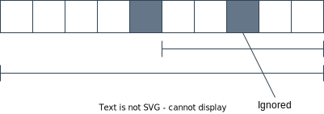

# Algorithm
*This document assumes that you have a basic understanding of how nonograms work and how to solve them.*

## Overview
Each cell of a nonogram can either be a box (filled) a space ("X") or empty.
For each vertical and horizontal line we have a list of numbers.
I will refer to these numbers as chains (of boxes).

The goal is to narrow down the possible locations of each chain until we can draw conclusions.
Let's look at an example:
We have one chain with a length of three inside the given range.

We can say for sure that the two cells outside the range must be spaces.
Also, as the chain has a length of three, regardless how far to the left or right the chain is, the center will always be covered.

## A single chain
We have three techniques we can apply to reduce the possible range.
The techniques are the same for left and right of a chain and columns and rows of a nonogram.
Thus, the examples below only show how to find the left bounds.

We will assume that there is only one chain in each line.
Later I will explain how to apply the steps with multiple chains.

### Reduce by box on the right
If we have a box on the right, we can say for sure that the left bounds must be close enough to still cover the box as every box must be covered.

### Reduce by neighbour boxes
Let's imagine we have some boxes just before the left bounds of a chain.
If the chain was actually touching these boxes it would not be a separate chain.
This of course makes no sense, thus, we can say for sure that the left bounds must be after these boxes.

### Reduce by spaces
The chain can of course not overlap with spaces, thus, we can reduce the range to the first gab in which the chain fits.
In the example the chain is 3 boxes long.

## Multiple chains
This is the tricky part.
If we look for the left bounds we start with the right most chain and look for the right most box as described.
As there is no chain to the right of the right most chain, the right most box must belong to that chain.
Then we apply the other two steps in the order as above.

Most likely the right most chain will still have a left bounds far to the left.
For now, we ignore this and continue with the second chain.
The range of these chains will likely overlap even if the second chain would be fully to the left.

If this is the case, we backtrack to the chain on the right, but now we reduce the start bounds according to the left chain.

Now we continue with the left chain.
Note that when we look for a box on the right, we ignore boxes inside the range of chains to the right.

To summarize: 
For the left bounds we start with the right most chain.
We apply all three techniques and continue with the next chain.
We apply all three techniques to that chain but if the range overlaps with the range of the previous chain, we go back to the previous chain.
We repeat these steps until we resolved all chains.

## Putting things together
After we applied the steps above we can draw conclusions as described in the overview.
Every cell we alter in a column will alter the corresponding row too.
We mark this row as dirty and continue with the other columns.
When we are done with columns we continue with rows and mark the corresponding columns as dirty.
We repeat these steps until we are done.

## Recursion
Some nonograms might require recursion as no more conclusions can be drawn.
In this case the nonogram and the layout information is copy inside memory.
Now we guess that one of the not solved cells is a box.
If trying to solve this nonogram fails, we know that it must have been a space in which case we alter the copy accordingly and continue with the copy.